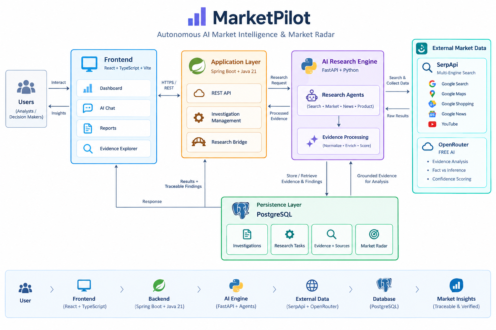

# MarketPilot 🚀
### Autonomous AI Market Intelligence & Radar
*Built for the **SerpApi India Hackathon 2026***

---

## 🛑 The Problem
Entrepreneurs and investors waste billions of dollars and months of effort on unverified business ideas. Generic AI chatbots (like ChatGPT) hallucinate market data, inventing fake competitor revenue, non-existent customer demand, and inaccurate setup costs.

---

## 💡 The Solution: MarketPilot
**MarketPilot** is an **evidence-driven market intelligence operating system** that eliminates AI hallucination. Instead of guessing, MarketPilot orchestrates a **multi-agent research swarm** via **SerpApi**, stores harvested market evidence in **PostgreSQL with cryptographic provenance**, and uses **OpenRouter AI** to generate actionable, audit-ready startup launch plans.

---

## 🔍 What We Use & Why (SerpApi Multi-Engine Swarm)
MarketPilot queries **7+ specialized SerpApi engines** to gather 360-degree real-world ground truth for *any* city worldwide:
- 🏢 **Google Maps / Local API (`google_local`)**: Discovers physical local competitors, star ratings, review counts, addresses, and original business websites (`Website ↗`).
- 🛍️ **Google Shopping API (`google_shopping`)**: Benchmarks real-time retail prices, product tiers, and wholesale equipment costs.
- 📰 **Google News API (`google_news`)**: Tracks macro industry developments, regulatory policy shifts, and timing signals.
- 📈 **Google Trends API (`google_trends`)**: Measures search interest trajectory and consumer demand momentum.
- 💼 **Google Jobs API (`google_jobs`)**: Evaluates sector hiring velocity and local talent availability.
- 📺 **YouTube API (`youtube`)**: Extracts verbatim customer pain points, vlogger reviews, and sentiment signals.
- 🔬 **Google Patents, Play Store & Hotels APIs**: Conditionally routed for deep-tech IP, mobile apps, or hospitality ventures.

---

## ✨ Key Winning Features
1. **🎯 Fact vs. Inference Matrix**: Separates verified SerpApi facts from AI inferences with plain-English explanations.
2. **🏢 Competitor Comparison Matrix**: Side-by-side benchmark table showing real ratings, review counts, pricing tiers, and direct original source links (`Source ↗`).
3. **🛡️ Interactive Risk-to-Mitigation Matrix**: Explains *"Why this impacts you"* and *"How to fix it"* in plain, simple, beginner-friendly language.
4. **🚀 Business Launch Blueprint & Cost Breakdown**: Mathematically allocates **100% of the user's total specified budget** across professional setup categories with evidence IDs.
5. **🎛️ AI "What-If" Sensitivity Simulator**: Interactive sliders (Budget Shift, Price Pressure, CAC Multiplier) that stress-test financial runway and break-even month in real time.
6. **⚖️ Multi-City Live Comparative Benchmarking**: Compares any business idea across two cities worldwide with live, on-demand SerpApi secondary market searching.
7. **🏗️ B2B Vendor & Equipment Sourcing Directory**: Discovers real-world machinery dealers and wholesale equipment suppliers.
8. **💬 ChatGPT-Style RAG Chat**: Interactive assistant with quick prompt suggestion pills and structured markdown table rendering.
9. **💱 Location-Based Currency Adaptation**: Automatically formats budgets in `₹` (INR), `£` (GBP), `$` (USD), `€` (EUR), or `¥` (JPY).

---

## 🏗️ Architecture


```text
React + Vite (Enterprise Light Theme UI)
      │
      ▼ REST API
Spring Boot + Java 21 (API Orchestrator & PostgreSQL Provenance DB)
      │
      ▼ HTTP Bridge
Python + FastAPI (Multi-Agent Planner & Evidence Scorer)
      │
      ├───────────────────────┬───────────────────────┐
      ▼                       ▼                       ▼
   SerpApi                 OpenRouter             PostgreSQL
(7+ Multi-Engines)    (Multi-Model Fallback)   (Relational DB)
```

---

## ⚙️ Quick Start

### 1) Environment Variables (`.env`)
Create a `.env` file at the root:
```ini
SERPAPI_KEY=your_serpapi_key_here
OPENROUTER_API_KEY=your_openrouter_key_here
OPENROUTER_MODEL=meta-llama/llama-3.1-70b-instruct:free
DATABASE_URL=jdbc:postgresql://localhost:5432/MarketPilot
DATABASE_USERNAME=pragadeeswaran
DATABASE_PASSWORD=pragadees
```

### 2) Python AI Engine
```bash
cd ai-engine
source .venv/bin/activate
pip install -r requirements.txt
python3 -m uvicorn main:app --reload --port 8000
```

### 3) Spring Boot Backend
```bash
cd backend
mvn spring-boot:run
```

### 4) React Frontend
```bash
cd frontend
npm install
npm run dev
```

---
*Built with ❤️ for the SerpApi India Hackathon 2026.*

## Free deployment

The repository includes `render.yaml` for deploying the frontend, Spring Boot API,
and FastAPI AI engine on Render's free web services. Use a free PostgreSQL
database from Neon (or another PostgreSQL provider), because the local
`database/docker-compose.yml` database is not public.

1. Push this repository to GitHub and create a Render Blueprint from the
   repository, using `render.yaml`.
2. Create a free Neon PostgreSQL project. Copy its **pooled connection string**
   into `DATABASE_URL`; use the Neon username and password for
   `DATABASE_USERNAME` and `DATABASE_PASSWORD`. The JDBC URL must start with
   `jdbc:postgresql://`.
3. After Render creates the services, copy their public URLs into these
   environment variables:
   - `marketpilot-api`: `AI_ENGINE_URL=https://marketpilot-ai.onrender.com`,
     `FRONTEND_URL=https://marketpilot-frontend.onrender.com`
   - `marketpilot-ai`: `BACKEND_URL=https://marketpilot-api.onrender.com`,
     `FRONTEND_URLS=https://marketpilot-frontend.onrender.com`
   - `marketpilot-frontend`: `VITE_API_BASE_URL=https://marketpilot-api.onrender.com`,
     `VITE_AI_ENGINE_URL=https://marketpilot-ai.onrender.com`
4. Add `SERPAPI_KEY` and `OPENROUTER_API_KEY` only in Render's environment
   settings, then redeploy all three services. Open the frontend URL in Chrome.

Free services may sleep when idle, so the first request can take up to a minute.
Never commit `.env`; rotate any API keys that were previously exposed.
